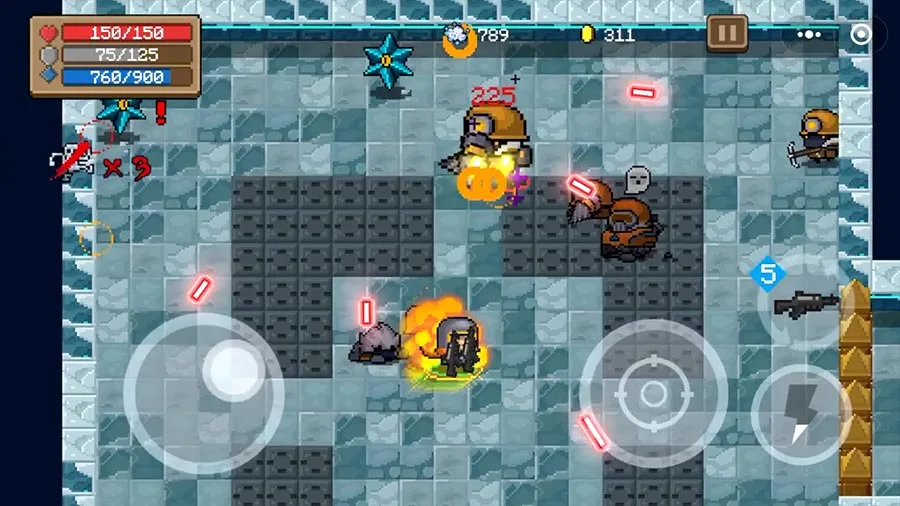

# j05

请将j04的迷宫任务改造为一个ruguelike的对战游戏(不限于葫芦娃主题）。下图供参考。

**游戏构思和实现请发挥想象力**，具体需求如下：

- **并发**：用多线程实现游戏中生物体的自主行为
  - 每个生物体的移动、攻击等行为决策可使用Minimax或其他算法（可参考https://www.baeldung.com/java-minimax-algorithm）
  - 请特别注意线程race condition（两个生物体不能占据同一个tile，对同一生物体的两个攻击行为应该先后发生作用，等）
  - **完成后录屏发小破站**
- **构建**：支持项目自动化构建
  - 使用maven进行所有第三方库的依赖管理和构建
  - **在github actions中运行构建过程**
- **测试**：编写junit单元测试用例
  - 代码测试覆盖率不低于50%（vscode请使用Coverage Gutters扩展，intellij IDEA请run with coverage）
  - **在github actions中运行测试过程**
- **IO**：提供游戏保存功能
  - 地图保存/地图加载
  - 进度保存/进度恢复
  - 游戏过程录制/回放
  - **完成后录屏发小破站**
- **网络通信**：支持网络对战
  - 支持多方（大于两方）对战
  - 要求使用NIO Selector实现
  - 要求通信过程全局状态一致（所有玩家看到的游戏过程完全一样），可通过各方分别录制游戏过程后进行比对验证
  - **完成后录屏发小破站**

