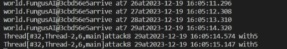
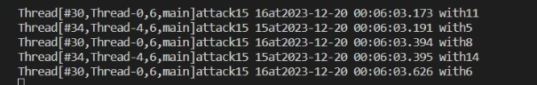

- **并发**：用多线程实现游戏中生物体的自主行为
  - 每个生物体的移动、攻击等行为决策可使用Minimax或其他算法（可参考https://www.baeldung.com/java-minimax-algorithm）
  - 请特别注意线程race condition（两个生物体不能占据同一个tile，对同一生物体的两个攻击行为应该先后发生作用，等）
  - **完成后录屏发小破站**

## 游戏内容
* 玩家(player)进入地图，以杀掉所有的敌人为目标，杀掉所有敌人即为胜利，如果所有玩家牺牲，失败。
* 每次的迷宫地图会更新，在每次运行前会生成一个新的地图。
* 攻击方式采用近战攻击，人物有攻击力和防御力，经过计算得到伤害，每次与敌人相遇都会互相攻击。
* 地图中设有墙壁和奖励，墙壁不可通过，奖励获得后会增加血量（上限100）。
* 敌人有自主行为，可以在一定范围内移动。

## 要求：
* race condition的情况：
  玩家和敌人如果要走进一个地区，a进入，a或b攻击，另外一个攻击是并发实现的(如果竞争的话会出现都到一个位置的情况，不会出现攻击)
  
  攻击具有先后性，敌人被打死以后不会多打一下。
  

## 视频链接

【课程作业临时投稿】 https://www.bilibili.com/video/BV1iG411r7V7/?share_source=copy_web&vd_source=1b5b11c14e55b37b2add139d4d269fa3
